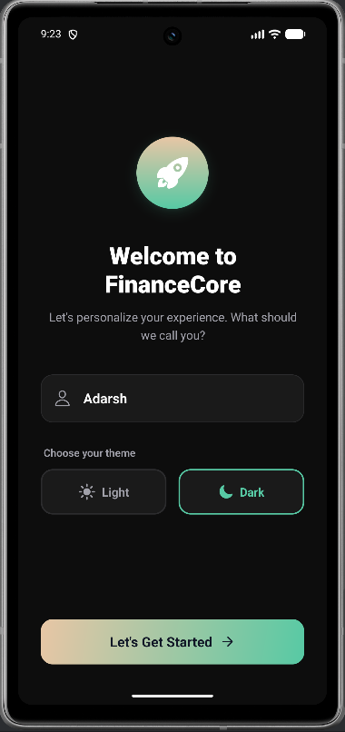
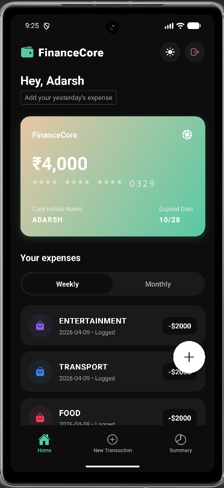
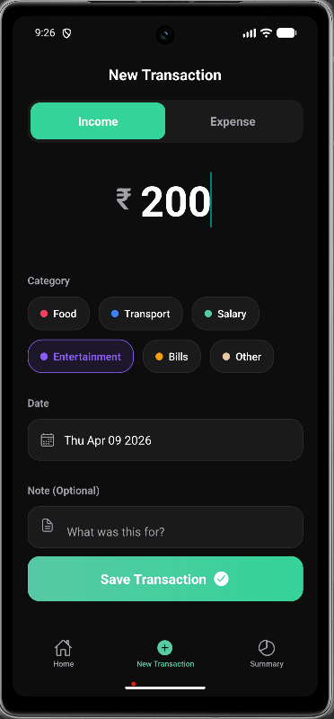
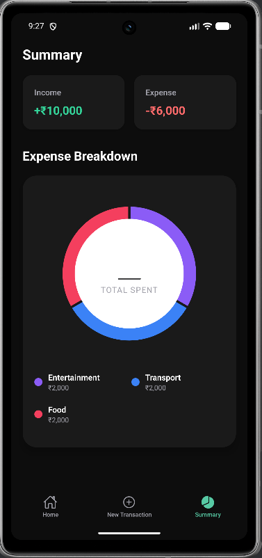

# 💳 FinanceCore

  
  
  
  

 

> **FinanceCore** is a premium, high-performance personal finance and expense tracking mobile application built with React Native. Designed with a strict adherence to a "Deep Dark" fintech aesthetic, it features fluid 60fps animations, persistent local storage, and a heavily optimized cross-platform UX that flawlessly supports modern OS environments like Android 15 Edge-to-Edge.

---

## ✨ Key Features

* **Premium "Deep Dark" UI:** A Figma-perfect implementation featuring subtle glassmorphism, dynamic gradients, and unified color coding across all screens.
* **Live Theme Previews:** Fully dynamic Light and Dark modes with real-time UI switching during the onboarding flow.
* **Interactive Activity Rings:** A highly customized, animated Donut/Pie chart built with `react-native-gifted-charts`, featuring tap-to-focus interactions and dynamic center labels.
* **Fluid Animations:** Powered by `react-native-reanimated`, featuring staggered list entrances, spring-loaded modals, and layout transitions.
* **Bulletproof Keyboard UX:** Custom native keyboard listeners and dynamically padded `ScrollViews` that bypass default OS bugs to ensure inputs and sticky buttons never overlap—even on Android 15.
* **Zero-Latency State:** State management and persistent local storage powered by **Zustand** and **MMKV**, ensuring user data and theme preferences load instantly on app boot.

---

## 📱 Visual Previews

*(📸 **Pro Tip:** Add your screenshots or GIFs to an `assets` folder in your repo and replace these placeholder links!)*

| Onboarding | Home Dashboard | Add Transaction | Analytics Summary |
|:---:|:---:|:---:|:---:|
|  |  |  |  |

---

## 🛠️ Tech Stack & Libraries

* **Framework:** React Native (CLI) / TypeScript
* **Navigation:** React Navigation (`@react-navigation/bottom-tabs`, `@react-navigation/native-stack`)
* **State Management:** Zustand
* **Local Storage:** Zustand Persist + MMKV 
* **Animations:** React Native Reanimated v3
* **Data Visualization:** React Native Gifted Charts
* **UI Components:** React Native Vector Icons (Ionicons), React Native Linear Gradient

---

## 🧠 Notable Technical Implementations

### 1. Android 15 Edge-to-Edge Keyboard Fixes
Modern Android OS updates aggressively enforce edge-to-edge drawing, which breaks the standard `KeyboardAvoidingView`. FinanceCore implements a custom hook utilizing raw `Keyboard.addListener` events to dynamically adjust `paddingBottom`, allowing sticky footer buttons to physically ride the keyboard while remaining visible over the OS gesture pills.

### 2. Custom Animated Modals (Bypassing Native Alerts)
Instead of relying on the un-stylable native `Alert.alert`, destructive actions (like Sign Out) trigger a custom Reanimated Modal. It features a dimmed background overlay, `ZoomIn.springify()` physics, and theme-compliant buttons to maintain total immersion.

### 3. Stable Category Color Hashing
Transactions use a highly unified color palette (e.g., Food is always Rose, Transport is always Blue). Instead of assigning colors via array indices (which shuffle when new items are added), FinanceCore uses a strict `Record<string, string>` mapping to ensure visual stability across the Home lists and Summary charts.

---

## 📂 Project Structure

📦 src
 ┣ 📂 assets           # Local fonts, images, and Lottie files
 ┣ 📂 navigation       # Root stack and Bottom Tabs setup
 ┣ 📂 screens
 ┃ ┣ 📜 OnboardingScreen.tsx  # Name capture & live theme setup
 ┃ ┣ 📜 HomeScreen.tsx        # Dashboard, Bank Card, Recent List
 ┃ ┣ 📜 AddTransactionScreen.tsx # Interactive form with sticky footer
 ┃ ┗ 📜 SummaryScreen.tsx     # Animated activity ring and breakdown
 ┣ 📂 store
 ┃ ┗ 📜 useStore.ts    # Zustand global state (Transactions, Theme, User)
 ┣ 📂 theme
 ┃ ┗ 📜 colors.ts      # Strict Light/Dark mode color palettes
 ┗ 📂 utils
   ┗ 📜 formatters.ts  # Currency and date parsing logic

---

## 🚀 Getting Started

### Prerequisites
* Node.js (v18+)
* React Native Development Environment (Ruby, Xcode, Android Studio)

### Installation

1. **Clone the repository:**
   git clone https://github.com/Adarsh311002/FinanceManager-Mobile-App-.git
   cd FinanceCore

2. **Install dependencies:**
   npm install

3. **Install CocoaPods (iOS only):**
   cd ios
   pod install
   cd ..

4. **Run the application:**
   # For iOS
   npm run ios
   
   # For Android
   npm run android

---

## 📝 License
This project is licensed under the MIT License - see the [LICENSE](LICENSE) file for details.

---

  <i>Crafted with precision and passion.</i>

